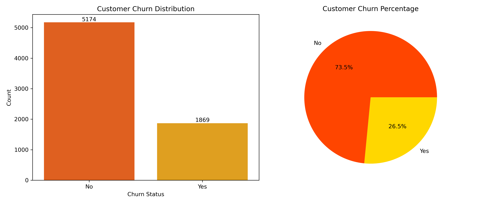
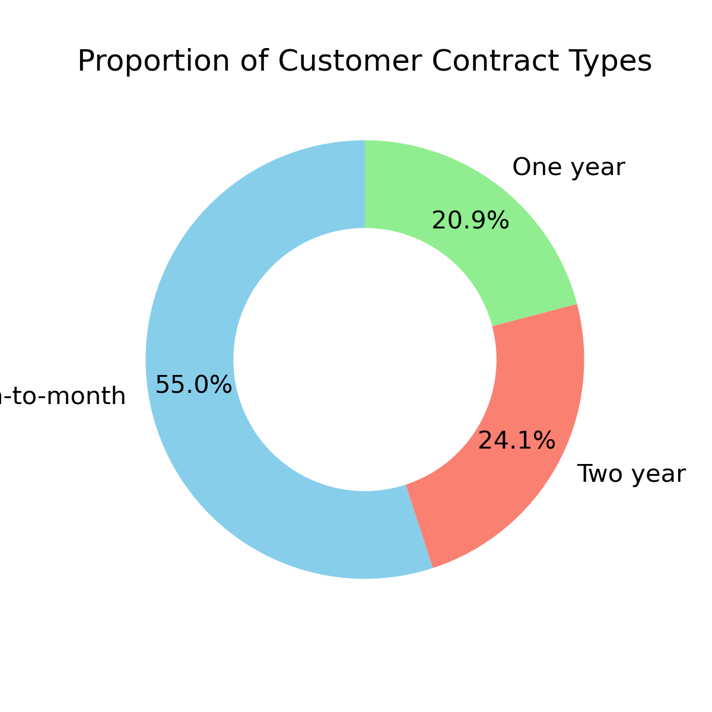
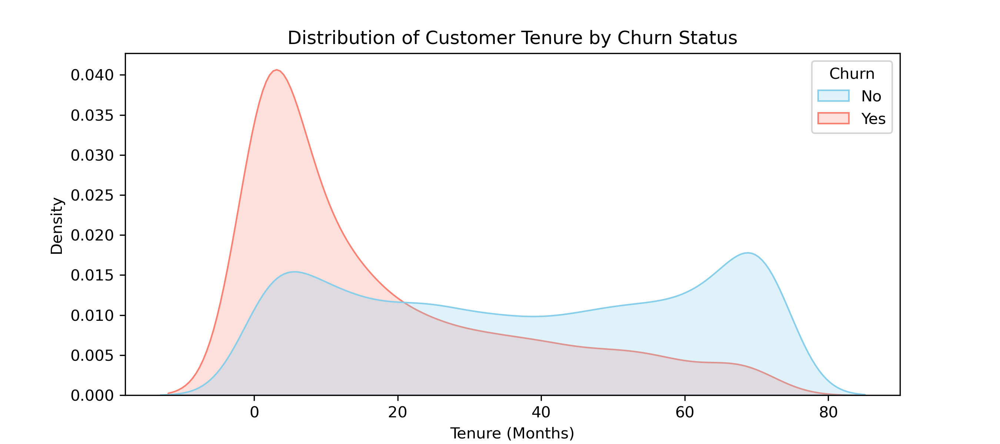
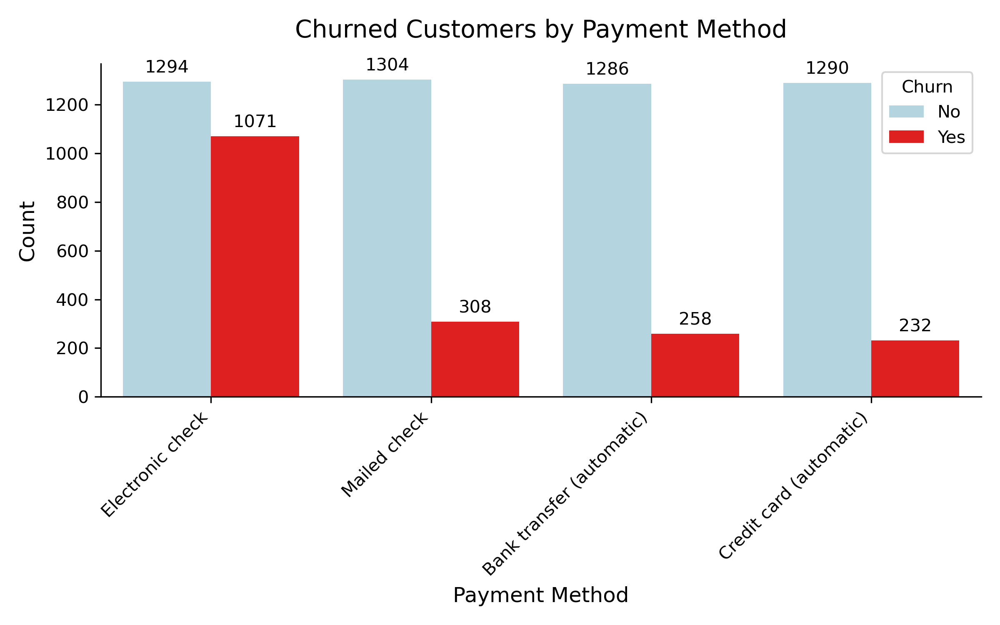
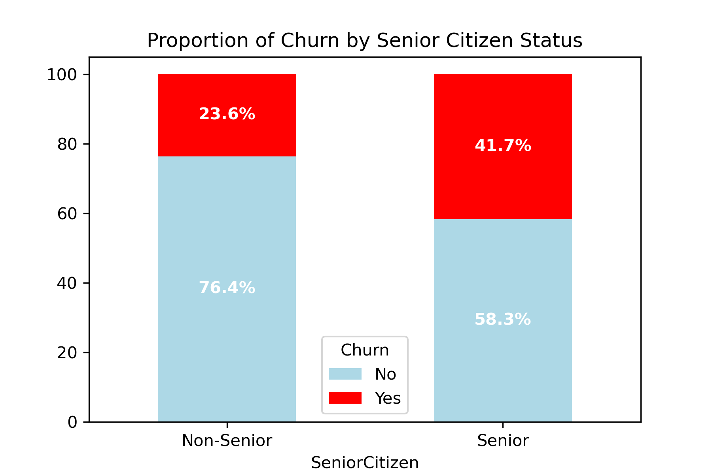
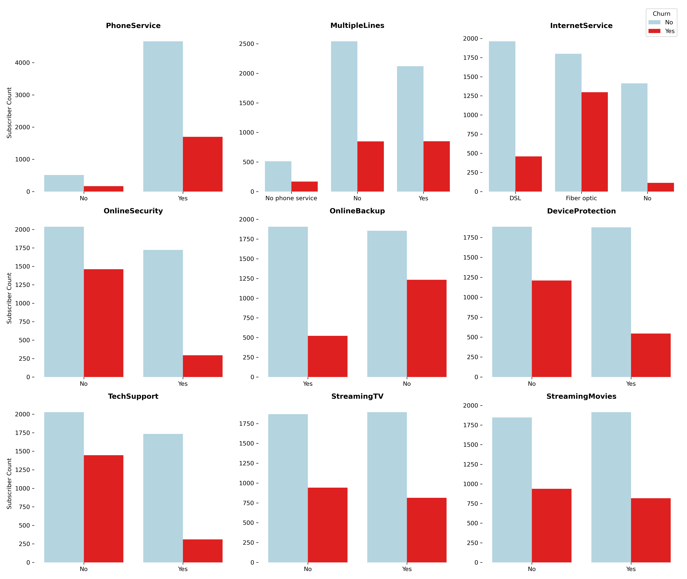

# 📊 Telco Customer Churn Analysis

> An exploratory data analysis of the Telco Customer Churn dataset, uncovering the key behavioral, demographic, and contractual drivers behind customer attrition.

## Table of Contents
- [Overview](#overview)
- [Problem Statement](#problem-statement)
- [Dataset](#dataset)
- [Tools and Technologies](#tools-and-technologies)
- [Methods](#methods)
- [Key Insights](#key-insights)
- [Dashboard and Key Visualizations](#dashboard-and-key-visualizations)
- [Results and Conclusion](#results-and-conclusion)
- [Future Work](#future-work)
- [Author and Contact](#author-and-contact)

## Overview

This project performs an in-depth **Exploratory Data Analysis (EDA)** on a telecom company's customer dataset to understand *why* customers leave and *which* customer segments carry the highest risk of churn. The analysis covers data cleaning, univariate and bivariate exploration, demographic and behavioral segmentation, and visualization-driven storytelling using Python, turning raw customer records into clear, business-actionable insights.

## Problem Statement

Customer churn directly erodes recurring revenue for subscription-based telecom businesses, and acquiring a new customer is significantly more expensive than retaining an existing one. This project analyzes historical customer data to identify the strongest drivers of churn across demographics, account details, billing behavior, and service subscriptions so the business can design targeted, data-backed retention strategies instead of generic, one-size-fits-all campaigns.

## Dataset

This project analyzes the [Customer-Churn-Dataset.csv](Customer-Churn-Dataset.csv), a widely recognized public dataset used for studying telecom customer attrition and behavioral patterns.

### Dataset Summary
- **Total Records:** 7,043 customers
- **Total Features:** 21 columns
- **Target Variable:** `Churn` (Yes / No)
- **File Format:** CSV

## Tools and Technologies

- **Python** – Core programming language
- **VS Code(.ipynb)** – Interactive analysis environment
- **Pandas / NumPy** – Data cleaning and manipulation
- **Matplotlib / Seaborn** – Visualization (bar, pie/donut, stacked, KDE plots)
- **Git & GitHub** – Version control and project hosting

## Methods

1. **Data Cleaning** — handled missing/blank values (e.g. in `TotalCharges`), fixed data types, standardized categorical labels.
2. **Univariate Analysis** — examined the distribution of churn, contract types, payment methods, and senior citizen share independently.
3. **Bivariate Analysis** — cross-analyzed churn against demographics (gender, senior citizen), account attributes (tenure, contract, payment method), and service subscriptions.
4. **Distribution Analysis** — used KDE plots to compare tenure distributions between churned and retained customers.
5. **Visualization-Driven Storytelling** — built bar, pie/donut, stacked-proportion, and density charts to translate raw counts into clear, decision-ready insights.

## Key Insights

1. **Overall churn rate is 26.54%** — roughly 1 in 4 customers leaves, a meaningful but not catastrophic attrition level typical of telecom subscriptions.
2. **Gender has no real impact on churn** — churn proportions are nearly identical for male and female customers, ruling it out as a useful predictor.
3. **Tenure is one of the strongest predictors of churn** — attrition is heavily concentrated in the first few months of service, while customers who pass the one-year mark become far more stable, with loyalty peaking around the 72-month mark. This highlights a critical early-life retention window.
4. **Senior citizens churn at almost double the rate of non-seniors** — 41.7% vs. 23.6%, even though seniors make up only 16.2% of the customer base, making age a strong secondary risk factor.
5. **Payment method strongly predicts retention** — Electronic Check users churn at **45.3%**, nearly 3x the rate of automatic payment methods (Bank Transfer ~16.7%, Credit Card ~15.2%, Mailed Check ~19.1%). Electronic Check users alone account for **over half (57.3%)** of all churned customers.
6. **Value-added services reduce churn, especially Tech Support and Online Security** — customers without these services churn far more often than subscribers, while Streaming TV and Streaming Movies show almost no influence on churn either way.
7. **Internet service type matters** — Fiber optic customers churn noticeably more than DSL users or customers with no internet service, hinting at possible pricing or service-quality friction.
8. **Contract type is the single biggest churn driver** — Month-to-month customers (55% of the entire base) churn far more than customers on One-year or Two-year contracts, confirming that the absence of a long-term commitment is the clearest churn signal in the data.

## Key Visualizations

### 1. Customer Churn Distribution

*Out of 7,043 customers, 26.54% (1,869) churned — the baseline for all further analysis.*

### 2. Churn by Contract Type

*Month-to-month contracts exhibit a 42.7% churn rate, identifying them as the primary driver of customer churn.*

### 3. Customer Tenure vs. Churn

*Churn is concentrated in the first few months of tenure; customers who pass year one become significantly more loyal.*

### 4. Churn by Payment Method

*Electronic Check users churn at ~45% — nearly 3x the rate of automatic payment methods, and over half of all churned customers.*

### 5. Churn by Senior Citizen Status

*Senior citizens churn almost twice as often (41.7%) as non-seniors (23.6%).*

### 6. Service Subscriptions vs. Churn

*Customers without Tech Support or Online Security churn substantially more; streaming add-ons show little effect either way.*

## Results and Conclusion

Churn at this telecom company is not random — it is concentrated among a clearly identifiable segment: **new customers (low tenure)**, those on **month-to-month contracts**, customers paying via **Electronic Check**, **senior citizens**, and customers without value-added services like **Tech Support** or **Online Security**. Gender and entertainment-streaming subscriptions, by contrast, have little to no bearing on churn.

These findings suggest the business could meaningfully reduce churn by:
- Proactively engaging customers within their first 90 days of service
- Incentivizing migration from month-to-month to annual/biennial contracts
- Encouraging a shift from Electronic Check to automatic payment methods
- Bundling Tech Support and Online Security into entry-level plans
- Designing senior-citizen-specific retention offers

## Future Work

- Build and compare classification models (Logistic Regression, Random Forest, XGBoost) to predict churn probability per customer.
- Evaluate models using Precision, Recall, F1, and ROC-AUC — accuracy alone is misleading on imbalanced churn data.
- Deploy the best model as an interactive Streamlit/Flask churn-risk scoring app.
- Build an interactive Power BI / Tableau dashboard for business stakeholders.
- Run a Customer Lifetime Value (CLV) analysis to prioritize retention spend.

## Author and Contact

**Lokesh Lohar**
- Email: lokeshglohar@gmail.com 
- LinkedIn: www.linkedin.com/in/loharlokesh
- GitHub: https://github.com/lokeshdata

⭐ If you found this project useful, consider giving the repository a star!
